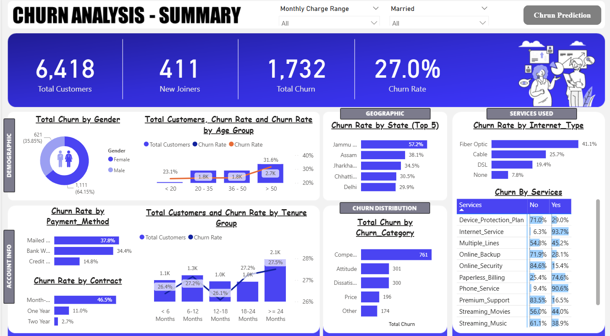

# 💡 Customer Attrition & Prediction Analysis (Power BI, Python & SQL)

**End-to-end Customer Churn Prediction using SQL, Python (RandomForest), and Power BI for actionable business insights.**

---

## 🚀 Project Overview

In this project, I **designed a complete pipeline to predict customer churn**, turning raw transactional data into actionable insights that help reduce revenue loss. I developed a full-stack solution, from SQL cleaning to a predictive ML model, with results delivered in an interactive Power BI dashboard.

| 🎯 **Goal** | **Methodology** | 💰 **Impact** |
| :--- | :--- | :--- |
| Reduce Churn | Full Data Pipeline: SQL → Python ML → Power BI Reporting | **84.52% Accuracy** in identifying high-risk customers |

---

## 🛠️ Technology Stack & Skills

| Tool / Technology | Skill Highlight |
| :--- | :--- |
| **SQL** (`SQL_Queries/`) | **Data Cleaning & Validation** (NULL checks, `ISNULL`) |
| **Python (RandomForest)** | **Predictive Modeling** to forecast churn 🤖 |
| **Power BI** | **Interactive Dashboards & DAX** modeling 📊 |
| **GitHub** | **Version Control** and delivery of results 📂 |

---

## 📈 Key Findings & Impact

* **Churn Rate:** **27.0%** 📉
* **Model Accuracy:** **84.52%** ✅
* **High-risk Customers:** **378** (see `Actionable_Predictions.csv`) 📞
* **Root Cause:** Month-to-Month contracts and lack of technical support services are primary drivers of churn 🚩

---

## 🖼️ Dashboard Visuals

### 1. Executive Summary
*High-level view showing key metrics, Churn Rate, and primary demographic drivers.*

### 2. Prediction & Actionable Insights
*Proof of the Machine Learning output, showing the count of predicted churners and their profile.*

---

## ⚙️ Repository Contents & How to Run

| File / Folder | Description |
| :--- | :--- |
| `Actionable_Predictions.csv` | Final list of high-risk Customer IDs |
| `Customer_Attrition_Dashboard.pbix` | Power BI report with full dashboards |
| `ML_Code_RandomForest.ipynb` | Python notebook for model training |
| `SQL_Queries/` | SQL scripts for data prep & cleaning |
| `Customer_Churn_Data.csv` | Raw dataset |

### How to Reproduce Results

1.  **SQL Preparation:** Run scripts in `SQL_Queries/` on `Customer_Churn_Data.csv` to clean and validate the dataset.
2.  **ML Modeling:** Run `ML_Code_RandomForest.ipynb` to train the predictive model and generate `Actionable_Predictions.csv`.
3.  **Visualization:** Open `Customer_Attrition_Dashboard.pbix` in Power BI Desktop to view the final report.

---
